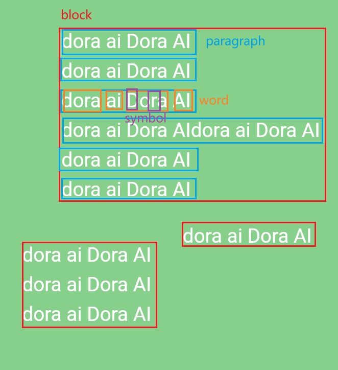

# Cog-segment-anything

## 1	配置服务器和replicate

1. 进入服务器

```
ssh ubuntu@<your-instance-ip>
```

2. 生成ssh-key

```shell
ssh-keygen -t ed25519 -C "your_email@example.com"
```

3. 添加ssh到个人github中

```shell
cat ~/.ssh/id_ed25519.pub
```

4. 在服务器中安装cog

```shell
sudo curl -o /usr/local/bin/cog -L https://github.com/replicate/cog/releases/latest/download/cog_`uname -s`_`uname -m`
sudo chmod +x /usr/local/bin/cog
```

5. Clone  this project

```shell
git clone git@github.com:riccardohhhhzz/dora-sam.git
```

6. 下载模型文件

```shell
wget -O sam_vit_h_4b8939.pth https://dl.fbaipublicfiles.com/segment_anything/sam_vit_h_4b8939.pth
```

7. 上传到replicate

```shell
sudo cog login
sudo cog push r8.im/<your-username>/<your-model-name>
```


## 2	配置Google cloud vision api

**官方教程文档**

* https://cloud.google.com/vision/docs/setup?hl=zh-cn
* https://cloud.google.com/vision/docs/ocr?hl=zh-cn

**测试SDK和身份验证**

```shell
gcloud auth application-default print-access-token
```

如果确认没有错误发生并且返回了凭据则身份验证通过。

**注意：**

1. 如果是本地环境，需要在端口开启代理，经实验socks5类型有问题，需要更换成http类型。（服务器端不需要配置）
2. 需要将你的`service_account.Credentials`json文件拷贝至项目的根目录下，并在`text_vision.py`中进行读取。


## 3	Vision Text Detection 返回结果层级关系




## 4	Run example locally

```shell
sudo cog predict -i image_path=@imgs/error_1.jpg
```


## 5	Reference

* [Grounded-Segment-Anything](https://github.com/IDEA-Research/Grounded-Segment-Anything/blob/main/grounded_sam.ipynb)
* [SAM-predictor](https://github.com/facebookresearch/segment-anything/blob/main/segment_anything/predictor.py)

* [Google Cloud Vision API](https://cloud.google.com/vision/docs/ocr?hl=zh-cn)

